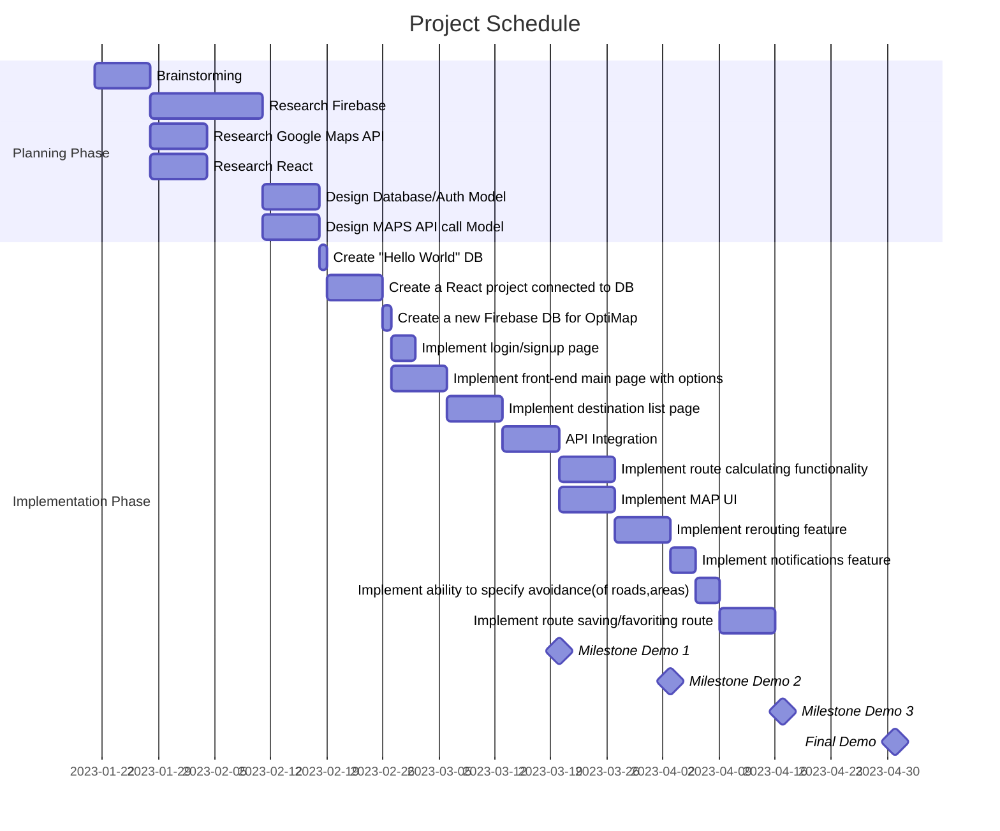

```mermaid
gantt
    dateFormat  YYYY-MM-DD
    title       Project Schedule

    section Planning Phase
    Brainstorming               :         des1, 2023-01-21, 7d
    Research Firebase               :         des2, after des1, 14d
    Research Google Maps API            :         des3, after des1, 7d
    Research React     : des4, after des1,7d
    Design Database/Auth Model : des5, after des2,7d
    Design MAPS API call Model: des6, after des2, 7d


    section Implementation Phase
    Create "Hello World" DB: des7, after des6,1d
    Create a React project connected to DB: des8,after des7,7d
    Create a new Firebase DB for OptiMap:des9, 2023-02-26,24h
    Implement login/signup page         :des10, after des9, 3d
    Implement front-end main page with options :des11, after des9, 7d
    Implement destination list page       :des12, after des11,7d
    API Integration: des13, after des12,7d
    Implement route calculating functionality: des14, after des13,7d
    Implement MAP UI: des15, after des13, 7d
    Implement rerouting feature: des16, after des15,7d
    Implement notifications feature: des17, after des16,3d
    Implement ability to specify avoidance(of roads,areas): des18,after des17,3d
    Implement route saving/favoriting route: des19,after des18,7d


   Milestone Demo 1                     :milestone, 2023-03-20, 0d
   Milestone Demo 2                     :milestone, 2023-04-03, 0d
   Milestone Demo 3                     :milestone, 2023-04-17, 0d
   Final Demo                           :milestone, 2023-05-01, 0d


```
