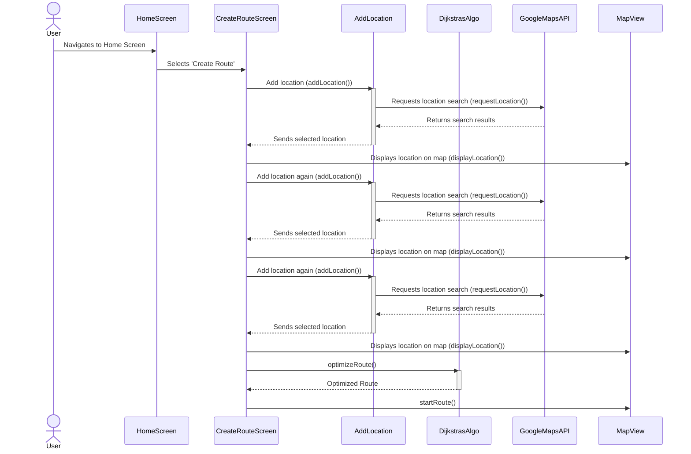

# Sequence Diagrams
## Sequence Diagram 1 (Use Case #1)

** *Use Case #1 Sequence Diagram: As a user, I would like to be able to add as many destinations as I want to my route* **

1. The User opens the OptiMap app
2. The User selects "Create Route"
3. The User types in a location and selects add
4. The User repeats this process until satisfied
5. The User selects Start Route