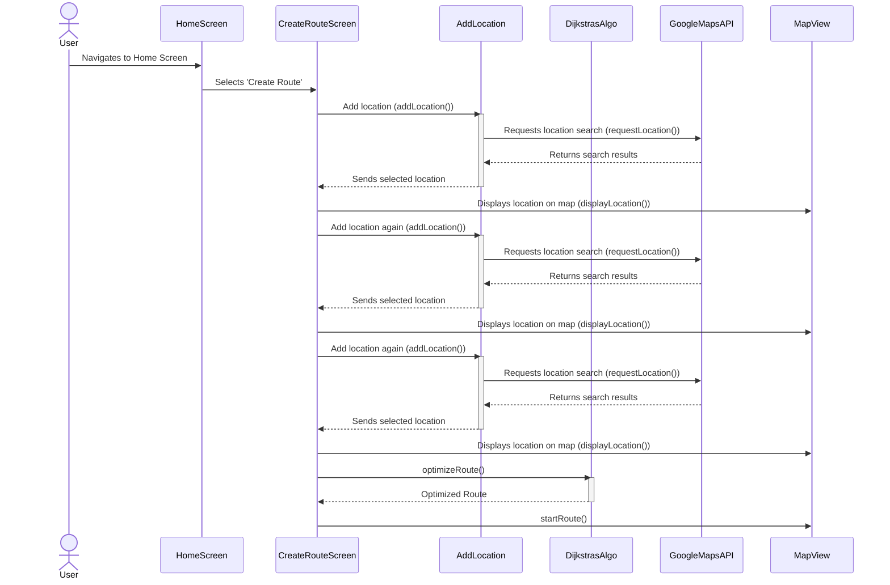
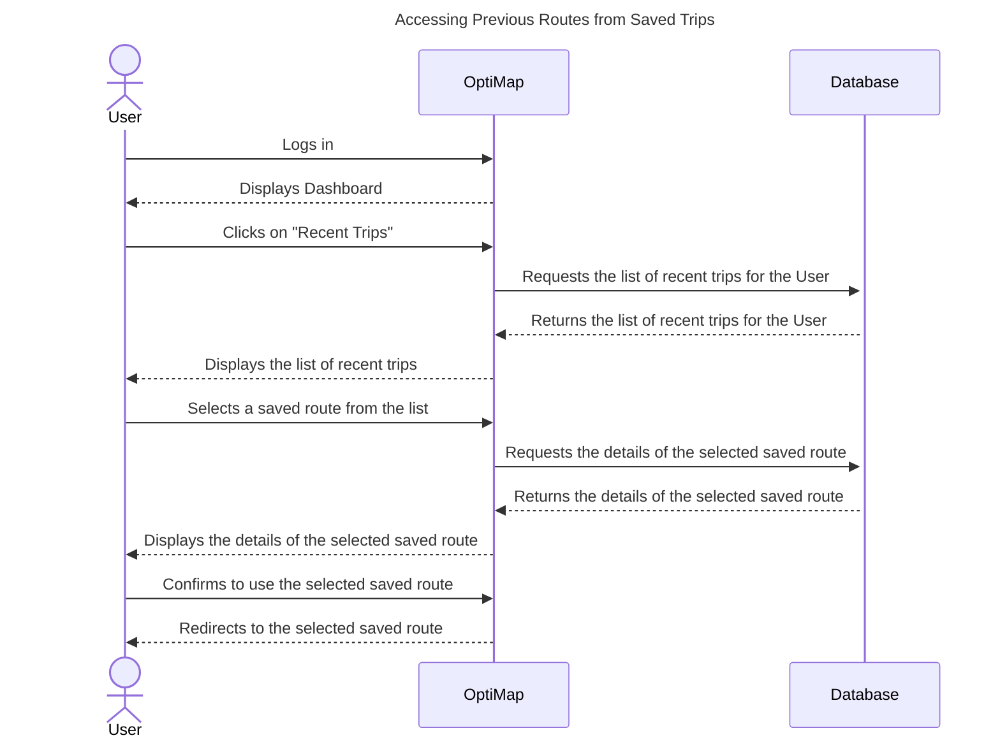
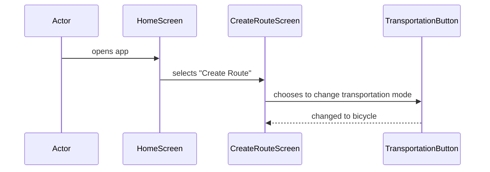
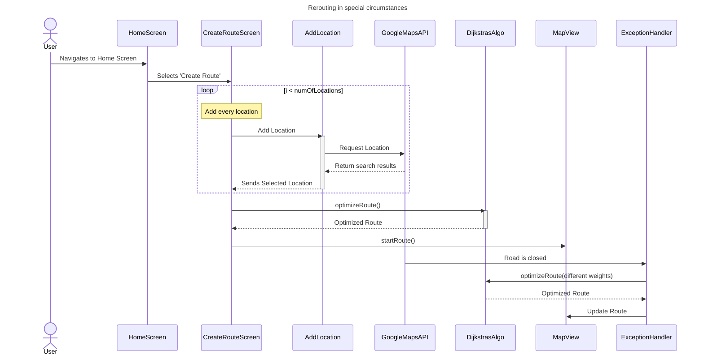
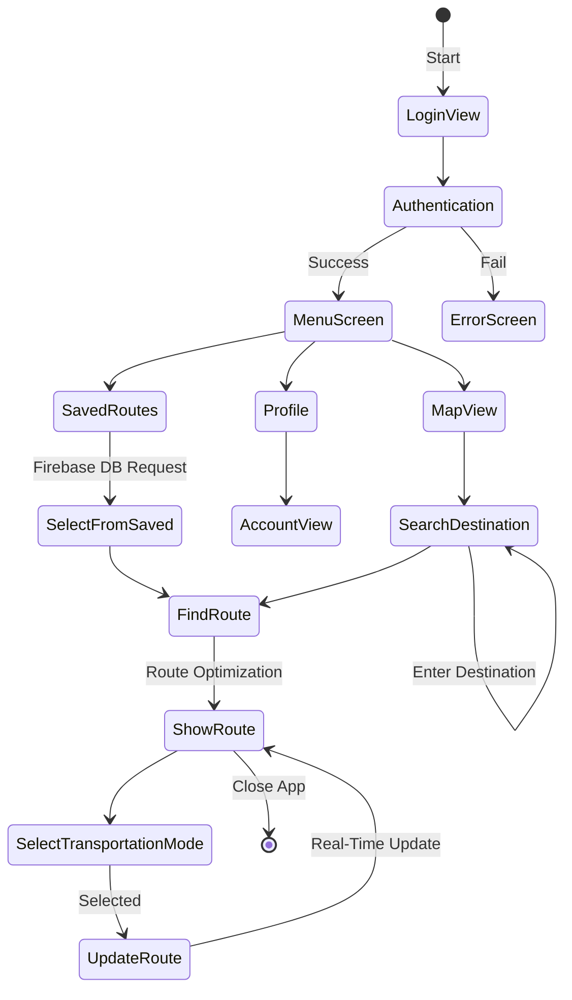

# Design

## Front-end Class Diagram

The LoginScreen class handles user's login credentials. The HomeScreen class shows the users the routes they have taken before and saved, along with directions. It then links to other classes such as MapView, RouteInput, NotificationPopup, and Settings. The MapView class shows the user the map of their route and allows them to interact with it, such as zooming in and out. The RouteInput class is where the user enters the locations they want to visit, and the time they plan to spend at each location. The NotifcationPopup class will allow the user to know if their planned route is not possible due to certain constraints such as traffic or time. The Settings class lets the user specify the time they plan to finish the route or other factors that would affect the route optimization. 

## Back-end Class Diagram

[](https://mermaid.live/edit#pako:eNp9VE1PwzAM_StRTiDoH9gBaQwhkPgSjFsvJvFGWJtMrjs0pv13kqxN163bpaqfnfeeXTcbqZxGOZJZluWWDRc4EregFhlaLSYFVJW4MzAnKHMba1TAEvRZIYksuxHvrmbMrRCvSzal-TsPTwlmM6PGb4_HuRfHxueAjbMfSCujIsEAHMuDg5C_A4YvqM6AyUsPPSHXq0kGjzL9RuJsorjYhFiIrPaBhRKbcOkLfh3pJqRg6cFU7GjdVhCujKv9iAlVMFU1iQpWqGMPLaIPSnbPq8LNjb247CJ_JoWKEBgjTcIC8x6yDY-unZhJ_RRuN6rWgx8MjvmpQXs-QOsWT1Jz5GnvxKBktxCb1OrPomKCPdWJN-ERY7n14vgb6R6Un2Z_IjNjdeSE4nSf3adMqryDwhfv8YUuutQg29C6NrRXNuTWYU0Gj6YFS80f6od9wU7aI4RMBld74FZeyxKpBKP97x2pcukH5FdRjvyrBlrkMrehDmp2H2ur5IipxmtZL70kNj95C6I2XvZ5d13EW2P7Dx0xZEI)

The database class stores and retrieves data for other classes, such as, including user data, route data, notification service data, optimizer data, and traffic API data. TrafficAPI class handles traffic data which will then be sent to the optimizer class to optimize the route based on real-time traffic conditions.  Route class contains information regarding a specific route, such as the locations and time expected to spend at each location. The optimizer class handles finding the optimal route for the user's inputted location, time constraints, and any other factors. It uses Dijkstra's algorithm and references the TrafficAPI to get traffic data for better optimization. NotificationServices class is responsible to notify the user if their planned route is not possible or if their are any other issues such as traffic or road blockage. The User class contains user information such as, login credentials, saved routes, route history, and directions. It has methods for

** Figure 1.0, *Front-end class Diagram* **

The LoginScreen class handles user's login credentials. The HomeScreen class shows the users the routes they have taken before and saved, along with directions. It then links to other classes such as MapView, RouteInput, NotificationPopup, and Settings. The MapView class shows the user the map of their route and allows them to interact with it, such as zooming in and out. The RouteInput class is where the user enters the locations they want to visit, and the time they plan to spend at each location. The NotifcationPopup class will allow the user to know if their planned route is not possible due to certain constraints such as traffic or time. The Settings class lets the user specify the time they plan to finish the route or other factors that would affect the route optimization. 

## Back-end Class Diagram

[](https://mermaid.live/edit#pako:eNp9VE1PwzAM_StRTiDoH9gBaQwhkPgSjFsvJvFGWJtMrjs0pv13kqxN163bpaqfnfeeXTcbqZxGOZJZluWWDRc4EregFhlaLSYFVJW4MzAnKHMba1TAEvRZIYksuxHvrmbMrRCvSzal-TsPTwlmM6PGb4_HuRfHxueAjbMfSCujIsEAHMuDg5C_A4YvqM6AyUsPPSHXq0kGjzL9RuJsorjYhFiIrPaBhRKbcOkLfh3pJqRg6cFU7GjdVhCujKv9iAlVMFU1iQpWqGMPLaIPSnbPq8LNjb247CJ_JoWKEBgjTcIC8x6yDY-unZhJ_RRuN6rWgx8MjvmpQXs-QOsWT1Jz5GnvxKBktxCb1OrPomKCPdWJN-ERY7n14vgb6R6Un2Z_IjNjdeSE4nSf3adMqryDwhfv8YUuutQg29C6NrRXNuTWYU0Gj6YFS80f6od9wU7aI4RMBld74FZeyxKpBKP97x2pcukH5FdRjvyrBlrkMrehDmp2H2ur5IipxmtZL70kNj95C6I2XvZ5d13EW2P7Dx0xZEI)

** Figure 1.1, *Back-end class Diagram* **

The database class stores and retrieves data for other classes, such as, including user data, route data, notification service data, optimizer data, and traffic API data. TrafficAPI class handles traffic data which will then be sent to the optimizer class to optimize the route based on real-time traffic conditions.  Route class contains information regarding a specific route, such as the locations and time expected to spend at each location. The optimizer class handles finding the optimal route for the user's inputted location, time constraints, and any other factors. It uses Dijkstra's algorithm and references the TrafficAPI to get traffic data for better optimization. NotificationServices class is responsible to notify the user if their planned route is not possible or if their are any other issues such as traffic or road blockage. The User class contains user information such as, login credentials, saved routes, route history, and directions. It has methods for

## Entity-relation Diagram

** Figure 1.2, *Entity-relation Diagram* **

**Figure 1.2** above shows the Entity-relation diagram of the database. We can see that for the **USER** table, the database will store *User_id*, *Username*, *Home_address*, and *Transportation_mode* values of a user. This table then uses another table called **ROUTE**, which will store *Route_id*, *Route_name*, *Location* and a foreign key from **USER** being the *User_id* value.

## Sequence Diagrams
### Sequence Diagram 1 (Use Case #1)

**Figure 1.3, *Use Case #1 Sequence Diagram: As a user, I would like to be able to add as many destinations as I want to my route* **

1. The User opens the OptiMap app
2. The User selects "Create Route"
3. OptiMap displays input box and MapView
4. The User types in a location 
5. OptiMap requests and verifies location
6. The User selects "Add Stop"
7. OptiMap displays stop on map
8. The User repeats this process until satisfied
9. The User selects Start Route

### Sequence Diagram 2 (Use Case #2)

**Figure 1.4, *Use Case #2 Sequence Diagram: As a user, I would like to be able to access previous routes that I have saved* **

1. The User opens the OptiMap app
2. The User selects "Recent Trips"
3. OptiMap requests database for saved trips
4. OptiMap displays saved trips to the User
5. The User selects a saved trip
6. OptiMap displays details of the selected trip
7. User selects "confirm"
8. OptiMap redirects User to the route on MapView

### Sequence Diagram 3 (Use Case #3)

**Figure 1.5, *Use Case #3 Sequence Diagram: As a user, I would like to be able to change the mode of transportation to further optimize my route* **

1. The User opens the OptiMap app
2. The User selects "Create Route"
3. OptiMap displays transportation methods option beside input box
4. The User selects bicycle transportation mode
5. OptiMap changes transportation mode to bicycle
### Sequence Diagram 4 (Use Case #4)

**Figure 1.6, *Use Case #4 Sequence Diagram: As a user, I would like to be able to set arrival times to each destination to further optimize my route* **

1. The User opens the OptiMap app
2. The User selects "Create Route"
3. OptiMap displays input box and MapView
4. The User types in a location 
5. OptiMap requests and verifies location
6. The User sets the arrival time for the location in another input box
7. The User selects "Add Stop"
7. OptiMap optimizes route by requesting distance and time information for all locations from Google Maps API
8. The User selects "Start Route"

### Sequence Diagram 5 (Use Case #5)

**Figure 1.7, *Use Case #5 Sequence Diagram: As a user, I would like for my route to be rerouted on the basis of various road and traffic conditions* **

1. The User opens the OptiMap app
2. The User selects "Create Route"
3. The User enters desired destinations and clicks "Start Route"
4. OptiMap displays optimized route to User
5. Google Maps API notifies OptiMap of road closure
6. OptiMap re-runs optimization on different roads 
7. OptiMap updates the map view and displays newly optimized route

## State Diagram

**Figure 1.8, *State Diagram* **

## Algorithm Description

The algorithm that will be used is Dijsktra's algorithm to help find the shortest distance between each location inputted by the user. Dijkstra's algorithm will be used in the Optimizer class to help achieve that function. The Optimizer class allows for user input in the form of a list of locations and then Dijsktra's algorithm will help assign weights to each location to help find the shortest path. The weights allow for the algorithm to keep track of the currently known shortest distance from node to node and updates if a shorter path is found. This process continues until all nodes are added from the user inputted list. Once that is complete, the list of locations will be reordered into the fastest path and then displayed to the user.