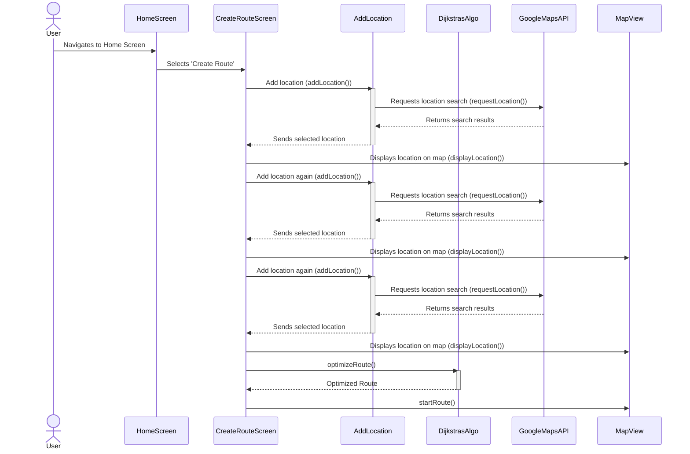
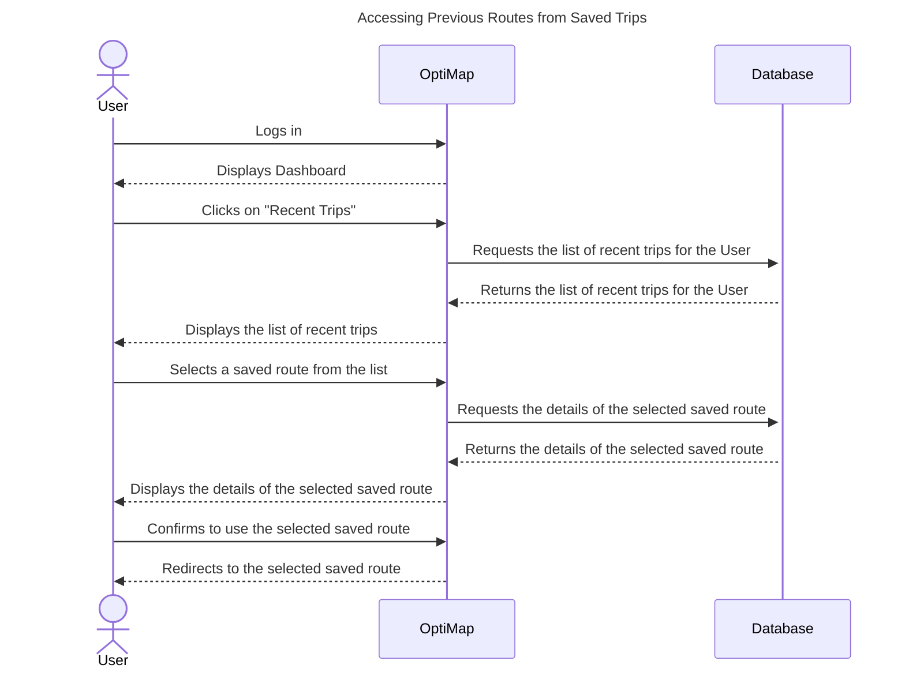
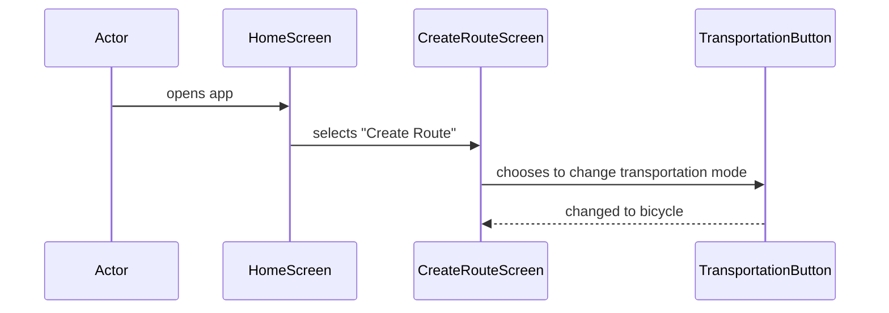
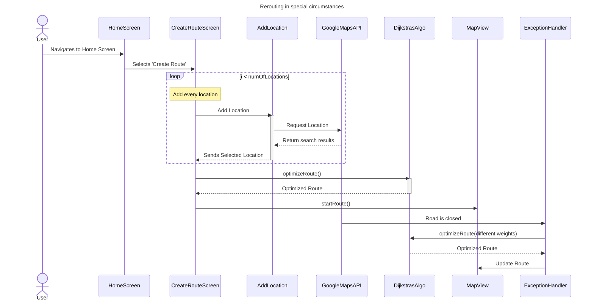

# Design

## Front-end Class Diagram

The LoginScreen class handles user's login credentials. The HomeScreen class shows the users the routes they have taken before and saved, along with directions. It then links to other classes such as MapView, RouteInput, NotificationPopup, and Settings. The MapView class shows the user the map of their route and allows them to interact with it, such as zooming in and out. The RouteInput class is where the user enters the locations they want to visit, and the time they plan to spend at each location. The NotifcationPopup class will allow the user to know if their planned route is not possible due to certain constraints such as traffic or time. The Settings class lets the user specify the time they plan to finish the route or other factors that would affect the route optimization. 

## Back-end Class Diagram

[](https://mermaid.live/edit#pako:eNp9VE1PwzAM_StRTiDoH9gBaQwhkPgSjFsvJvFGWJtMrjs0pv13kqxN163bpaqfnfeeXTcbqZxGOZJZluWWDRc4EregFhlaLSYFVJW4MzAnKHMba1TAEvRZIYksuxHvrmbMrRCvSzal-TsPTwlmM6PGb4_HuRfHxueAjbMfSCujIsEAHMuDg5C_A4YvqM6AyUsPPSHXq0kGjzL9RuJsorjYhFiIrPaBhRKbcOkLfh3pJqRg6cFU7GjdVhCujKv9iAlVMFU1iQpWqGMPLaIPSnbPq8LNjb247CJ_JoWKEBgjTcIC8x6yDY-unZhJ_RRuN6rWgx8MjvmpQXs-QOsWT1Jz5GnvxKBktxCb1OrPomKCPdWJN-ERY7n14vgb6R6Un2Z_IjNjdeSE4nSf3adMqryDwhfv8YUuutQg29C6NrRXNuTWYU0Gj6YFS80f6od9wU7aI4RMBld74FZeyxKpBKP97x2pcukH5FdRjvyrBlrkMrehDmp2H2ur5IipxmtZL70kNj95C6I2XvZ5d13EW2P7Dx0xZEI)

The database class stores and retrieves data for other classes, such as, including user data, route data, notification service data, optimizer data, and traffic API data. TrafficAPI class handles traffic data which will then be sent to the optimizer class to optimize the route based on real-time traffic conditions.  Route class contains information regarding a specific route, such as the locations and time expected to spend at each location. The optimizer class handles finding the optimal route for the user's inputted location, time constraints, and any other factors. It uses Dijkstra's algorithm and references the TrafficAPI to get traffic data for better optimization. NotificationServices class is responsible to notify the user if their planned route is not possible or if their are any other issues such as traffic or road blockage. The User class contains user information such as, login credentials, saved routes, route history, and directions. It has methods for

## Entity-relation Diagram

## Sequence Diagrams
### Sequence Diagram 1 (Use Case #1)

** *Use Case #1 Sequence Diagram: As a user, I would like to be able to add as many destinations as I want to my route* **

1. The User opens the OptiMap app
2. The User selects "Create Route"
3. The User types in a location and selects add
4. The User repeats this process until satisfied
5. The User selects Start Route

### Sequence Diagram 2 (Use Case #2)

** *Use Case #2 Sequence Diagram: As a user, I would like to be able to access previous routes that I have saved* **

### Sequence Diagram 3 (Use Case #3)

** *Use Case #3 Sequence Diagram: As a user, I would like to be able to change the mode of transportation to further optimize my route* **
### Sequence Diagram 4 (Use Case #4)

### Sequence Diagram 5 (Use Case #5)

** *Use Case #5 Sequence Diagram: As a user, I would like for my route to be rerouted on the basis of various road and traffic conditions* **